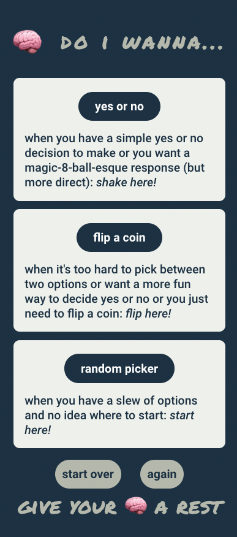
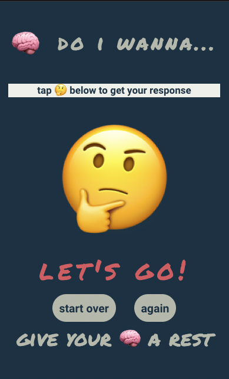
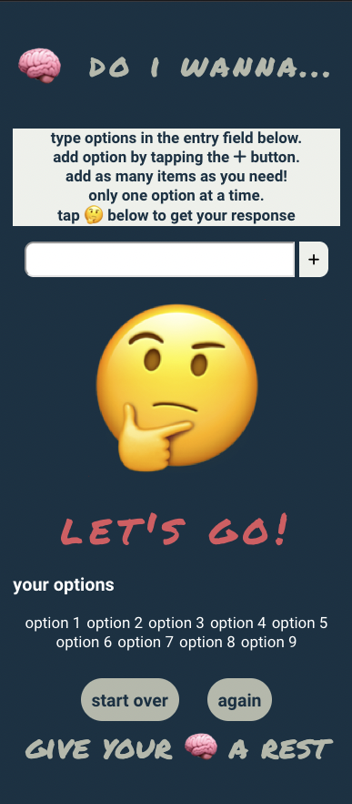
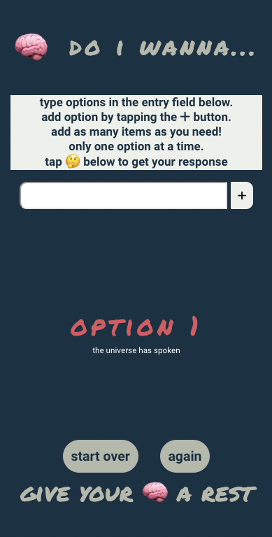

# do i wanna...
this web app is designed for mobile devices

## what is it?
do i wanna... is a tool made for:

 - people that struggle to make decisions
 - people that flip coins for any reason what so ever (excluding as a fidget)

## how does it work?

[try it for yourself](https://do-i-wanna-react.vercel.app/)

you will be greeted on the home screen by three options to proceed:
- yes or no => will only give yes or no answers
- flip a coin => will give a heads or a tails answer
- random picker => will take in user provided options, do a series of intense calculations, and reveal one

### home screen
- 
---
### start page for yes/no and coin flip
- 
---
### start page for picker with options entered
- 
---
### picker screen with response
- 
